## Author 
Bernardo Mota Coelho 
125059

Tiago Francisco Crespo do Vale
125913

## ========= System Architecture Diagram =======

---

## ============ Data Flow Diagrams ================

### **File Deletion Data Flow**  

---

### **File Restoration Data Flow**  
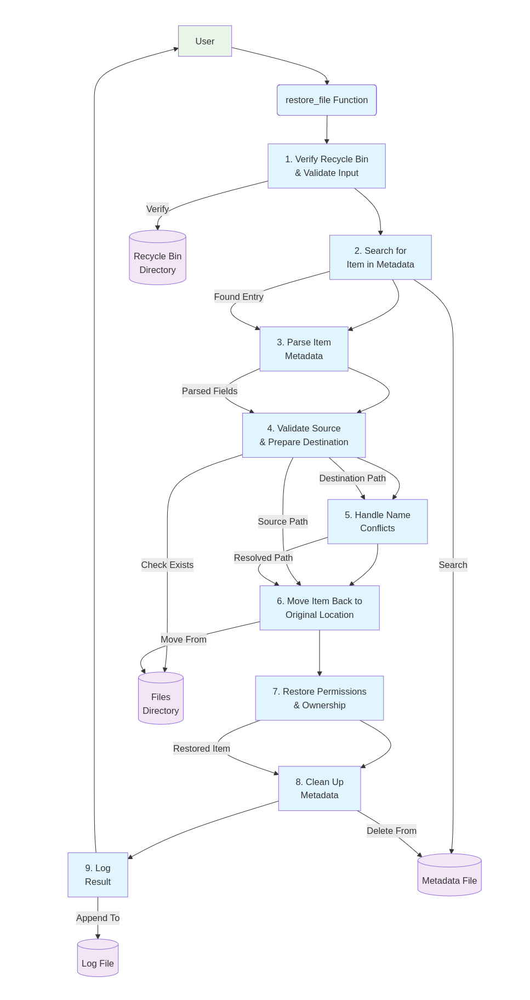

---

### **File List Data Flow**  
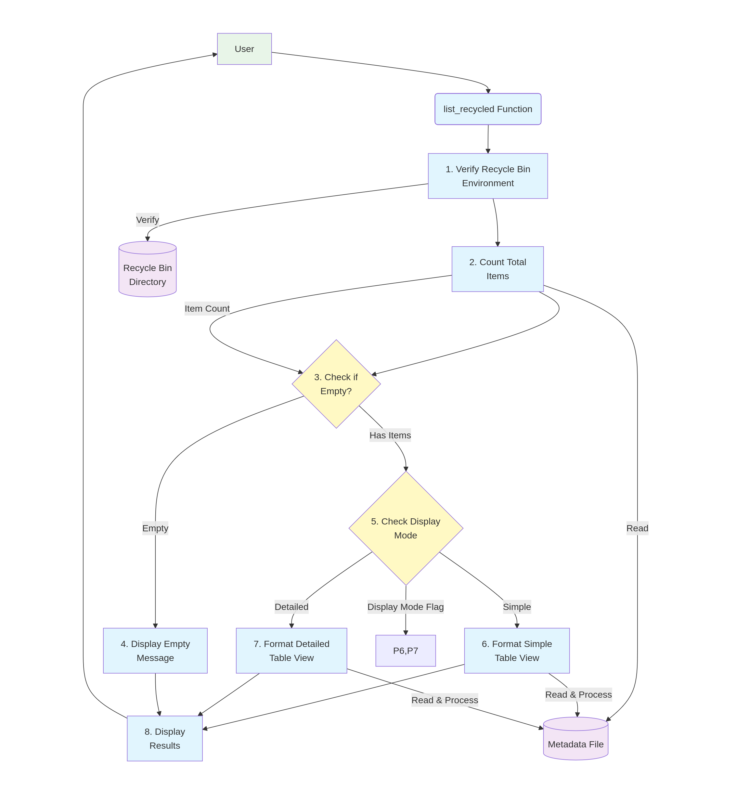

---

### **File Search Data Flow**  
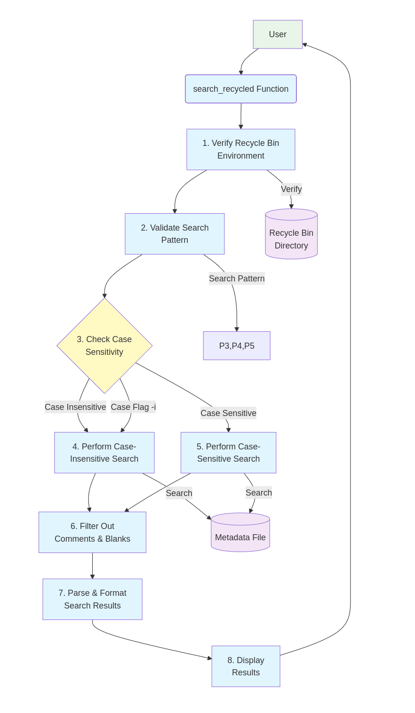

---

### **Empty Recycle Bin Data Flow**  
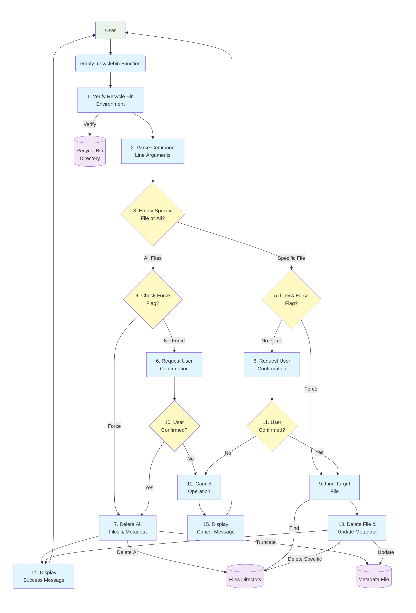

---

### **Show Statistics Data Flow**  
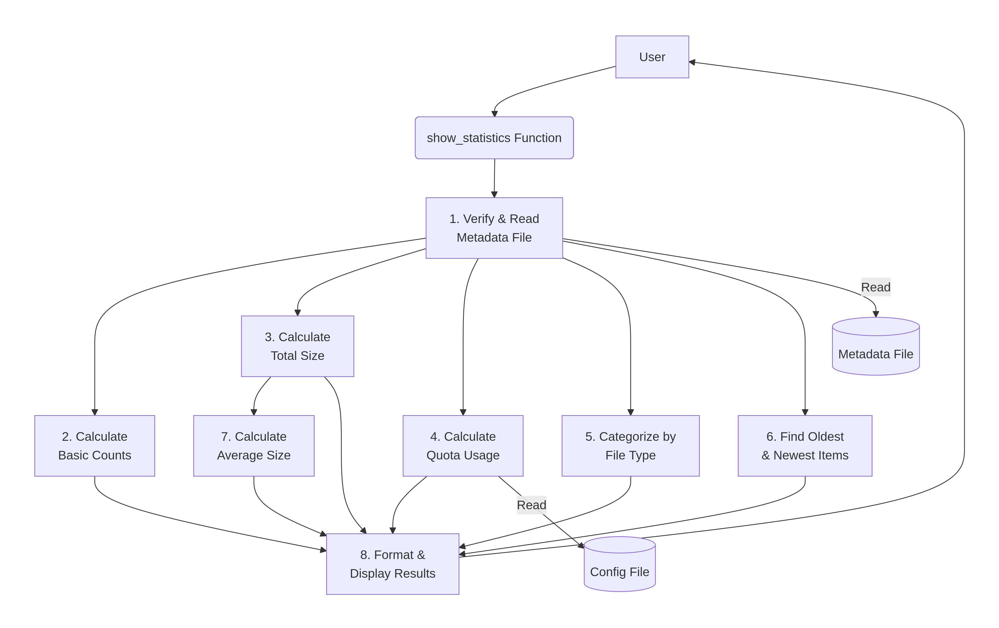

---

### **Cleanup Data Flow**  
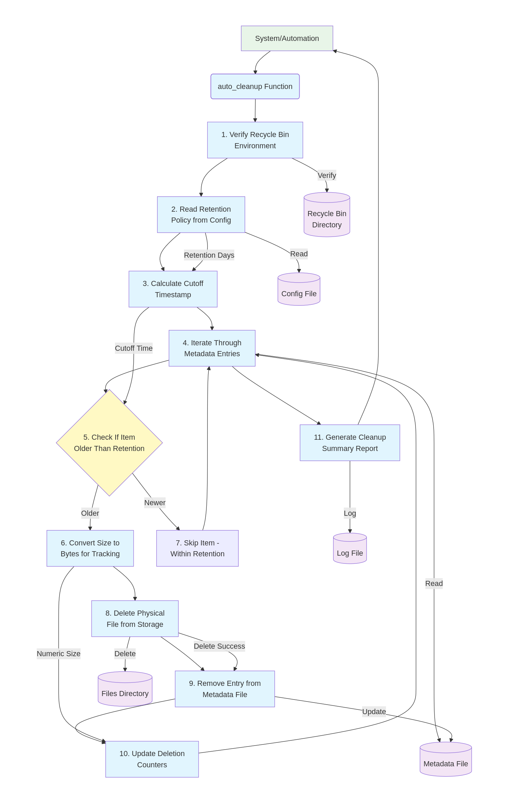

---

### **Preview File Data Flow**  
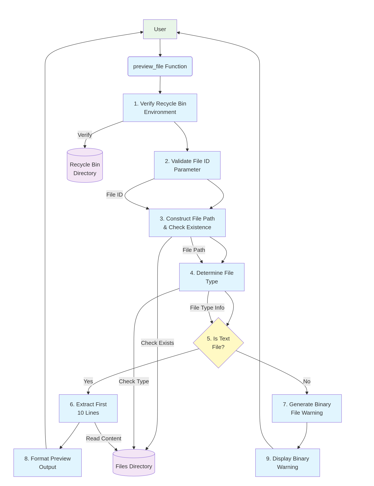

## ============ Metadata schema explanation ===========

The system (Recycle Bin) stores informations about files that have been deleted securely and can be recovered later. The Metadata.db file contains the data base that stores the details of the files.

Metadata table:

The metadata table stores information about deleted files. It has the following attributes:

ID: A unique identifier for each file in the recycle bin.

ORIGINAL_NAME: The original name of the file before it was moved to the recycle bin.

ORIGINAL_PATH: The full path of the original file.

DELETION_DATE: The date and time when the file was moved to the recycle bin.

FILE_SIZE: The size of the file in bytes.

FILE_TYPE: The type of the file.

PERMISSIONS: The permissions of the file.

OWNER: The owner of the file.

## ======== Function descriptions =============

### `initialize_recyclebin`
- **Description**: Creates recycle bin directory structure;
- **Parameters**: None;
- **Return**: Returns 0 on success and 1 on failure.

### `delete_file`
- **Description**: Moves file/directory to recycle bin;
- **Parameters**: path to file/directory;
- **Return**: Returns 0 on success and 1 on failure.

### `list_recycled`
- **Description**: Lists all items in recycle bin;
- **Parameters**: (Optional) --detailed for detailed view;
- **Return**: Returns 0 on success.

### `restore_file`
- **Description**: Restores a file from recycle bin to its original location;
- **Parameters**: file ID or original name;
- **Return**: Returns 0 on success and 1 on failure.

### `search_recycled`
- **Description**: Display all the files that contains the pattern given by the user;
- **Parameters**: search patterns;
- **Return**: Returns 0 on success and 1 on failure.

### `empty_recyclebin`
- **Description**: Permanently deletes all items in recycle bin;
- **Parameters**: (Optional) --force to delete without confirmation;
- **Return**: Returns 0 on success and 1 on failure.

### `verif_rbin`
- **Description**: Auxiliary funtion to verify if the recycle bin was initialized;
- **Parameters**: None;
- **Return**: Returns 0 if the recycle bin is initialized.

### `display_help`
- **Description**: Displays comprehensive usage information and examples;
- **Parameters**: None;
- **Return**: Returns 0.

### `show_statistics`
- **Description**: Displays overall statistics of the recycle bin;
- **Parameters**: None;
- **Return**: Returns 0 on success and 1 on failure.

### `auto_cleanup`
- **Description**: Automatically deletes items older than the configured retention period;
- **Parameters**: None;
- **Return**: Returns 0 on success and 1 on failure.

### `check_quota`
- **Description**: Check if recycle bin exceeds MAX_SIZE_MB;
- **Parameters**: None;
- **Return**: Returns 0 if usage does not exceed the limit, 1 if exceeded.

### `preview_file`
- **Description**: Show first 10 lines for text files in recycle bin;
- **Parameters**: fileID or original filename
- **Return**: Returns 0 on success and 1 on failure.

### `recycle_report`
* **Description**: Generates a detailed text report containing Recycle Bin statistics and metadata for all deleted files;
* **Parameters**: None
* **Return**: Returns 0 on success and 1 on failure.

### `report_error`
* **Description**: Allows the user to report errors or issues, saving the message with timestamp and username to a dedicated log file;
* **Parameters**: Optional message (if not provided, prompts user for input)
* **Return**: Returns 0 on success and 1 on failure.

## ======== Design decisions and rationale ========== 

### 1. **Directory and File Structure**
- **Decision**: The system creates a directory structure to store the files in the recycle bin (`$HOME/BernardoTiago_RecycleBin`) and metadata files (`metadata.db`).
- **Rationale**: Keeping an organized structure for both files and metadata is essential for easy maintenance and recovery of data. Separating files from the database allows for scalability and ensures data integrity.

### 2. **Use of Metadata for File Storage**
- **Decision**: The system uses a metadata file (`metadata.db`) to store information about the files moved to the recycle bin, including name, path, deletion date, type, permissions, owner, and size.
- **Rationale**: Metadata allows for the restoration of files to their original location with all original permissions and attributes intact. It also enables searching and listing files in the recycle bin without the need to manually check each file.

### 3. **File Naming with Unique ID**
- **Decision**: When moving a file to the recycle bin, it is renamed with a unique ID generated from a timestamp and a random string.
- **Rationale**: Creating a unique identifier for each file prevents conflicts when files have the same name. It also makes managing files in the recycle bin easier since each file can be uniquely identified for restoration or deletion.

### 4. **Secure File Deletion**
- **Decision**: Before moving a file to the recycle bin, the system checks its existence, read/write permissions, and ensures that the recycle bin itself cannot be deleted.
- **Rationale**: Security checks prevent accidental deletion of important system files or directories. The protection against deleting the recycle bin itself ensures the system doesn't fail if a user accidentally tries to clear the entire recycle bin.

### 5. **Size Quota Configuration**
- **Decision**: The recycle bin has a size limit (`MAX_SIZE_MB`) that restricts the space used by files.
- **Rationale**: The size limit ensures the recycle bin doesn't grow indefinitely and consume all system space. When the limit is reached, the system can prompt the user to clean up, maintaining an efficient file management system.

### 6. **File Retention**
- **Decision**: Files in the recycle bin are retained for a configured period (`RETENTION_DAYS`), after which they are automatically deleted.
- **Rationale**: File retention prevents the recycle bin from accumulating unnecessary files over time, freeing up space and keeping the system organized. Automatic deletion after a retention period helps manage storage and avoid old, unused data taking up space.

### 7. **Permanent Deletion with Confirmation**
- **Decision**: Permanent file deletion requires user confirmation (unless using the `--force` mode).
- **Rationale**: The confirmation step prevents accidental deletion of important files. The `--force` option provides a faster way for advanced users to delete files without confirmation, but this option is restricted to prevent unintended data loss.

### 8. **Backup and Recovery**
- **Decision**: The restore function (`restore_file`) allows files to be restored to their original location, keeping their permissions and owner intact.
- **Rationale**: Ensuring files can be restored with the same attributes and permissions as when deleted is critical to maintaining data integrity. Renaming files automatically in case of naming conflicts prevents overwriting existing files.

### 9. **File Search**
- **Decision**: The system allows searching for files in the recycle bin by ID or name, with the option for case-insensitive searches.
- **Rationale**: The search functionality allows users to quickly find files in the recycle bin without manually browsing through all files. Case-insensitive search improves flexibility and user convenience.

### 10. **Log File Keeping**
- **Decision**: The system maintains a log file (`recyclebin.log`) that records all actions performed on the recycle bin, including deletions, restorations, and failures.
- **Rationale**: Keeping a log of actions provides an audit trail and helps with troubleshooting. It also allows the system administrator or user to track operations, identifying errors or unexpected behaviors.

### Conclusion
These design decisions ensure that the recycle bin system is efficient, secure, and user-friendly. The focus on preventing accidental deletions, maintaining data integrity, and controlling storage usage guarantees that the system operates smoothly and predictably.

## =========== Algorithm explanations ================

### 1. **File Management in the Recycle Bin**

#### **File Deletion Algorithm**
1. **Input**: Path of the file or directory to be moved to the recycle bin.
2. **Process**:
   - Checks if the recycle bin directory exists. If not, initializes the recycle bin.
   - Validates the existence of the file/directory to be deleted.
   - Generates a unique ID for the file using a timestamp and random string.
   - Collects metadata for the file (name, path, deletion date, size, type, permissions, and owner).
   - Moves the file/directory to the recycle bin directory.
   - Stores the metadata in the `metadata.db` file.
3. **Output**: The file is moved to the recycle bin, and its metadata is recorded in the `metadata.db` file.

#### **File Restoration Algorithm**
1. **Input**: ID or original name of the file to be restored.
2. **Process**:
   - Searches for the file in the recycle bin, using the ID or original name.
   - Verifies if the file exists in the recycle bin.
   - Creates the destination directory if needed.
   - Restores the file to its original path or renames it if a conflict exists.
   - Restores the original permissions and owner of the file.
   - Removes the metadata of the restored file from the `metadata.db` file.
3. **Output**: The file is restored to its original location with permissions and owner restored.

### 2. **File Search Algorithm**

1. **Input**: The search pattern provided by the user.
2. **Process**:
   - Searches the `metadata.db` file for all files that match the provided pattern.
   - The pattern can be case-insensitive depending on the `-i` option.
   - Displays the search results with details such as name, path, deletion date, size, and type.
3. **Output**: List of files that match the provided search pattern, with details.

### 3. **Automatic Cleanup Algorithm**

1. **Input**: None (configured by default with `RETENTION_DAYS`).
2. **Process**:
   - Verifies all files in the recycle bin that have been deleted for more than `RETENTION_DAYS`.
   - For each file, calculates the deletion date and compares it to the current date.
   - Permanently deletes files exceeding the retention period.
   - Updates the `metadata.db` file by removing deleted files.
3. **Output**: Old files are permanently deleted, and the metadata database is updated.

### 4. **Quota Check Algorithm**

1. **Input**: None.
2. **Process**:
   - Calculates the total space usage in the recycle bin by summing the size of all files recorded in the `metadata.db` file.
   - Compares the total usage with the configured size limit (`MAX_SIZE_MB`).
   - If the total usage exceeds the quota, prompts the user to initiate automatic cleanup.
3. **Output**: Returns a warning message if the quota is exceeded and prompts the user to clean up.

### 5. **Permanent Deletion Algorithm**

1. **Input**: ID of the file to be permanently deleted.
2. **Process**:
   - Locates the file in the recycle bin using the ID.
   - Permanently deletes the file from the system.
   - Removes the metadata of the file from the `metadata.db` file.
3. **Output**: The file is permanently deleted, and the metadata is updated.

## Conclusion

These algorithms ensure that the recycle bin system efficiently manages deleted files, restores files, and controls storage usage, while also providing options for automatic cleanup and quota management.

## ========= Flowcharts for complex operations ===========

### **File Deletion Flow**  
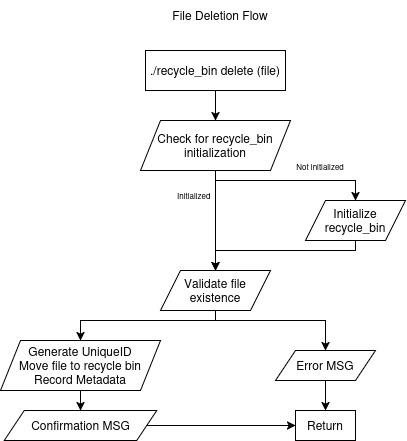

---

### **File Restoration Flow**  

---

### **File List Flow**  
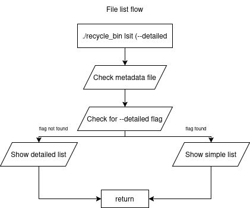

---

### **File Search Flow**  

---

### **Empty Recycle Bin Flow**  

---

### **Display Help Flow**  
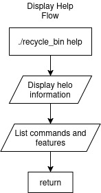

---

### **Show Statistics Flow**  
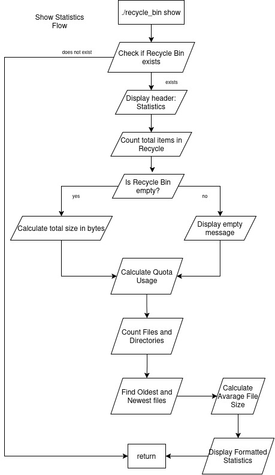

---

### **Cleanup Flow**  

---

### **Preview File Flow**  
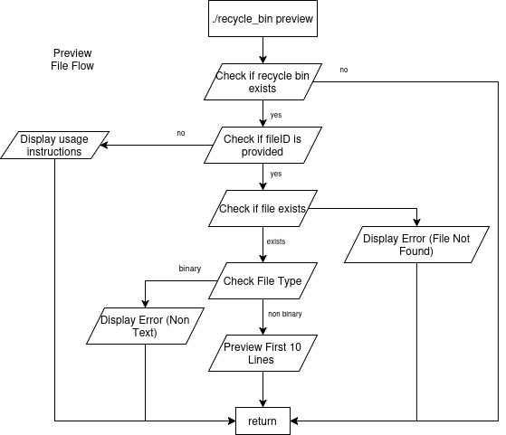
